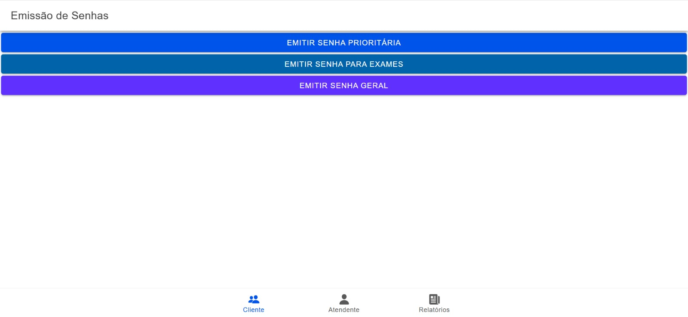
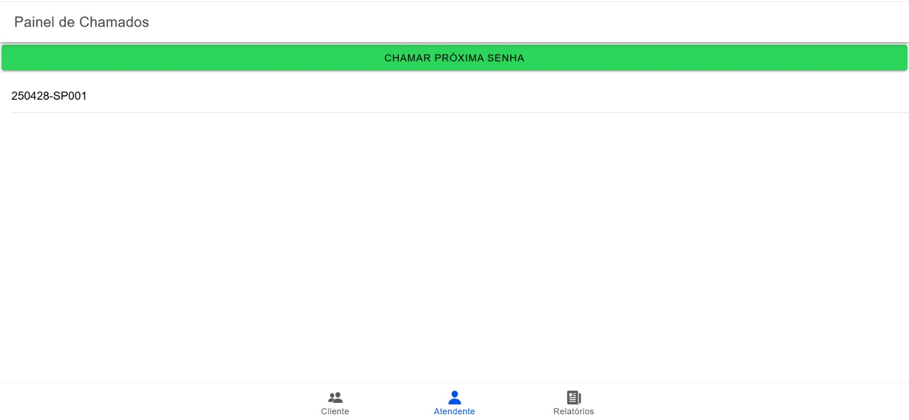

# Tickets

Sistema de controle de atendimento em filas de laboratórios médicos, desenvolvido como projeto acadêmico para a disciplina de Desenvolvimento de Aplicativos Móveis.

O objetivo é criar um aplicativo móvel, sem necessidade de integração com backend, que gerencie a emissão e o controle de senhas para atendimento, respeitando regras de prioridade e horários de expediente.

## 📱 Telas do Aplicativo

### Tela de Emissão de Senhas
- Escolha entre as opções: Prioritário (SP), Geral (SG) e Retirada de Exames (SE).
- Exibe a senha gerada no formato `YYMMDD-PPSQ`.



### Tela de Painel de Chamados
- Mostra as 5 últimas senhas chamadas.
- Indica o número da senha e o guichê para atendimento.



## ⚙️ Requisitos para Rodar o Projeto

- **Node.js** (versão 16.x ou superior)
- **Ionic CLI** (instalar com `npm install -g @ionic/cli`)
- **Capacitor** (para build mobile)
- **Editor de Código** (recomendado: Visual Studio Code)
- **Git** (para controle de versão)

### Como Rodar

```bash
# Clone o repositório
git clone https://github.com/seu-usuario/tickets.git

# Acesse a pasta do projeto
cd tickets

# Instale as dependências
npm install

# Rode o aplicativo no navegador
ionic serve

```
## 📜 Licença

Este projeto está licenciado sob a [Creative Commons Attribution 4.0 International License](LICENSE.md).
